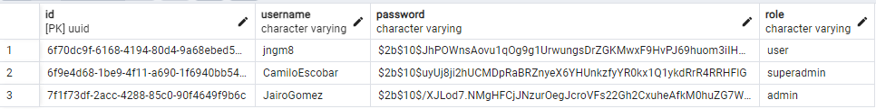

# Base Project Web Development Course

- Take this project to guide your learning process towards the achievement of the goals in the course
- This project is a guide. Follow the instructions in BN course and the documentation provided

# Instructions for the correct execution of the project

1. Download the front and back project in your devices
2. Install dependencies with npm install
3. Set the pgAdmin database following the tutorials from the course and use the information in the app.module from the back project and use it on the pgAdmin
4. Register your user in the register view. This will by default set you a user role
5. Register with 2 other user, and then in pgAdmin you can see the 3 users you just registered with the user role
6. Change the role of one of the users to admin directly in the database, in the column role and save the changes. Do the same with the other user to superadmin
7. Now you can enter the app with 3 users with different roles, and see all functionalities

user role: List tournaments. list enrolled tournaments, enroll tournaments

admin role: Create tournaments, list tournaments

superadmin role: Delete tournaments, list tournaments

## Example of how your pgAdmin should look

